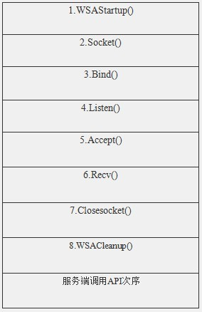
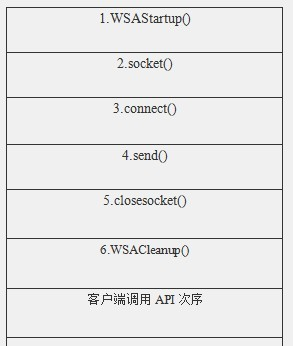

### 1. 服务端

#### 1. 函数调用

#### 2. 示例代码

~~~c++
// Server.cpp : 定义控制台应用程序的入口点。
//
#include "stdafx.h"
#include "winsock2.h"
#define  BUF_SZIE     64
#pragma comment(lib, "ws2_32.lib")

int main(int argc, char* argv[])
{
    WSADATA            wsad;            //WSADATA变量
    SOCKET            Server;        //服务器套接字
    SOCKET            Client;        //客户端套接字
    SOCKADDR_IN        addrServ;        //服务器地址
    char            buf[BUF_SZIE];        //接收数据缓冲区
    int                retVal;        //返回值

    //初始化套接字动态库
    if (WSAStartup(MAKEWORD(2,2),&wsad) != 0)
    {
        printf("初始化套接字动态库失败!\n");
        return 1;
    }
    
    //创建套接字
    Server = socket(AF_INET, SOCK_STREAM, IPPROTO_TCP);    
    if(INVALID_SOCKET == Server)
    {
        printf("创建套接字失败!\n");
        WSACleanup();//释放套接字资源;
        return  -1;
    }
    
    //服务器套接字地址 
    addrServ.sin_family = AF_INET;
    addrServ.sin_port = htons(2012);
    addrServ.sin_addr.s_addr = INADDR_ANY;        
    //绑定套接字
    retVal = bind(Server, (LPSOCKADDR)&addrServ, sizeof(SOCKADDR_IN));
    if(SOCKET_ERROR == retVal)
    {    
        printf("绑定套接字失败!\n");
        closesocket(Server);    //关闭套接字
        WSACleanup();            //释放套接字资源;
        return -1;
    }
    
    //开始监听 
    retVal = listen(Server, 1);
    if(SOCKET_ERROR == retVal)
    {
        printf("监听失败!\n");        
        closesocket(Server);    //关闭套接字
        WSACleanup();            //释放套接字资源;
        return -1;
    }
    
    //接受客户端请求
    sockaddr_in addrClient;
    int addrClientlen = sizeof(addrClient);
    Client = accept(Server,(sockaddr FAR*)&addrClient, &addrClientlen);
    if(INVALID_SOCKET == Client)
    {
        printf("接受客户端请求失败!\n");        
        closesocket(Server);    //关闭套接字
        WSACleanup();            //释放套接字资源;
        return -1;
    }
    
    //接收客户端数据
    ZeroMemory(buf, BUF_SZIE);
    retVal = recv(Client, buf, BUF_SZIE, 0);
    if (SOCKET_ERROR == retVal)
    {
        printf("接收客户端请求失败!\n");        
        closesocket(Server);    //关闭套接字
        closesocket(Client);    //关闭套接字        
        WSACleanup();            //释放套接字资源;
        return -1;
    }

    printf("%s\n", buf);    //输出来自Client的字符串    

    //退出
    closesocket(Server);    //关闭套接字
    closesocket(Client);    //关闭套接字
    WSACleanup();            //释放套接字资源;
    return 0;
}
~~~

### 2. 客户端

####  1. 函数调用

#### 2. 示例代码

~~~c++
// Client.cpp : 定义控制台应用程序的入口点。
//

#include "stdafx.h"
#define    BUF_SZIE    64
#include "winsock2.h"
#pragma comment(lib, "ws2_32.lib")

int main(int argc, char* argv[])
{

    WSADATA            wsad;            //WSADATA变量
    SOCKET            sHost;            //服务器套接字
    SOCKADDR_IN        servAddr;        //服务器地址
    char            buf[BUF_SZIE];    //接收数据缓冲区
    int                retVal;            //返回值
    
    //初始化套接字动态库
    if (WSAStartup(MAKEWORD(2,2), &wsad) != 0)
    {
        printf("初始化套接字失败!\n");
        return -1;
    }
    
    //创建套接字
    sHost = socket(AF_INET, SOCK_STREAM, IPPROTO_TCP);    
    if(INVALID_SOCKET == sHost)
    {
        printf("创建套接字失败!\n");
        WSACleanup();//释放套接字资源
        return  -1;
    }

    //设置服务器地址
    servAddr.sin_family =AF_INET;
    servAddr.sin_addr.s_addr = inet_addr("127.0.0.1");
    servAddr.sin_port = htons((short)2012);
    int    nServAddlen  = sizeof(servAddr);

    //连接服务器
    retVal=connect(sHost,(LPSOCKADDR)&servAddr, sizeof(servAddr));    
    if(SOCKET_ERROR == retVal)
    {
        printf("连接服务器失败!\n");    
        closesocket(sHost);    //关闭套接字
        WSACleanup();        //释放套接字资源
        return -1;
    }
    
    //向服务器发送数据
    ZeroMemory(buf, BUF_SZIE);
    strcpy(buf, "2012年12月13日");
    retVal = send(sHost, buf, strlen(buf), 0);
    if (SOCKET_ERROR == retVal)
    {
        printf("发送数据失败!\n");
        closesocket(sHost);    //关闭套接字
        WSACleanup();        //释放套接字资源
        return -1;
    }
    
    //退出
    closesocket(sHost);    //关闭套接字
    WSACleanup();        //释放套接字资源
    return 0;
}
~~~

