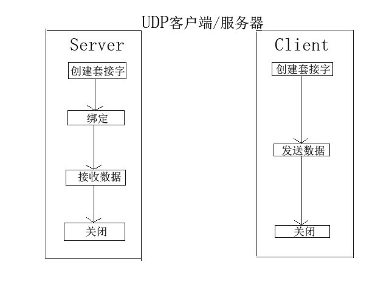
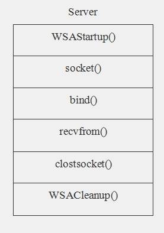

UDP套接字编程：

首先介绍UDP套接字服务端和客户端的工作模式，如图所示：




```c++
//recvfrom()函数声明如下
int recvfrom (
    SOCKET            s,    //套接字
    char FAR *        buf,    //接收数据缓冲区
    int            len,    //接收数据缓冲区大小
    int            flags,    //该参数影响recvfrom()函数的行为
    struct sockaddr FAR*    from,    //返回发送数据主机地址
    int FAR *        fromlen    //地址长度
);
//调用成功返回接收数据字节数，失败则返回SOCKET_ERROR


//sendto()函数声明如下
int    sendto(
    SOCKET                s,    
    const char FAR *        buf,
    int                len,
    int                flags,    //该参数影响sendto()函数的行为
    const struct sockaddr    FAR *    to,    //接收数据地址
    int                tolen    //接收数据地址长度
);
//调用成功返回接收数据字节数，失败则返回SOCKET_ERROR

//flags:该参数可为：0表示函数无特殊行为；
//                             MSG_DONTROUTE要求传输层不要将数据路由出去；
//                             MSG_OOB预示该数据应该被带外发送
```




Server Code:

```c++
// server.cpp : 定义控制台应用程序的入口点。
//

#include "stdafx.h"
#define  BUF_SZIE     64
#include "winsock2.h"
#pragma comment(lib, "ws2_32.lib")

int main(int argc, char* argv[])
{
    
    WSADATA            wsd;            //WSADATA变量
    SOCKET            s;                //套接字
    SOCKADDR_IN        servAddr;        //服务器地址
    char            buf[BUF_SZIE];    //接收数据缓冲区
    
    //初始化套结字动态库
    if (WSAStartup(MAKEWORD(2,2), &wsd) != 0)
    {
        printf("初始化套接字动态库失败!\n");
        return 1;
    }
    
    //创建套接字
    s = socket(AF_INET, SOCK_DGRAM, 0);
    if (s == INVALID_SOCKET)
    {
        printf("创建套接字失败，失败原因; %d\n", WSAGetLastError());
        WSACleanup();//释放套接字资源
        return 1;
    }
    //服务器地址
    servAddr.sin_family = AF_INET;
    servAddr.sin_port = htons((short)2012);            //端口
    servAddr.sin_addr.s_addr = htonl(INADDR_ANY);    //IP
    
    //绑定
    if (bind(s, (SOCKADDR *)&servAddr, sizeof(servAddr)) == SOCKET_ERROR)
    {
        printf("绑定失败，失败原因: %d\n", WSAGetLastError());
        closesocket(s);    //关闭套接字
        WSACleanup();    //释放套接字资源
        return 1;
    }    
    
    //接收数据
    SOCKADDR_IN clientAddr;
    int nClientLen = sizeof(clientAddr);
    ZeroMemory(buf, BUF_SZIE);
    if(recvfrom(s, buf, BUF_SZIE, 0, (SOCKADDR*)&clientAddr, &nClientLen) == SOCKET_ERROR)
    {
        printf("接收数据失败，失败原因: %d\n", WSAGetLastError());
        closesocket(s);    //关闭套接字
        WSACleanup();    //释放套接字资源
        return 1;
    }    

    printf("%s\n", buf);//输出
    
    closesocket(s);        //关闭套接字
    WSACleanup();        //释放套接字资源
    return 0;
}
```

Client Code:

```c++
// Client.cpp : 定义控制台应用程序的入口点。
//
#include "stdafx.h"
#define  BUF_SZIE     64
#include "winsock2.h"
#pragma comment(lib, "ws2_32.lib")

int main(int argc, char* argv[])
{
    
    WSADATA        wsd;                //WSADATA变量
    SOCKET         s;                //套接字
    SOCKADDR_IN    servAddr;        //服务器地址
    char            buf[BUF_SZIE];    //发送数据缓冲区
    
    //初始化套结字动态库
    if (WSAStartup(MAKEWORD(2,2), &wsd) != 0)
    {
        printf("初始化套接字动态库失败!\n");
        return 1;
    }

    //创建套接字
    s = socket(AF_INET, SOCK_DGRAM, 0);
    if (s == INVALID_SOCKET)
    {
        printf("创建套接字失败，错误代码; %d\n", WSAGetLastError());
        WSACleanup();//释放套接字资源
        return 1;
    }
    
    //赋值“2012年12月17日”
    ZeroMemory(buf, BUF_SZIE);
    strcpy(buf, "2012年12月17日");
    
    //服务器地址
    servAddr.sin_family =AF_INET;
    servAddr.sin_addr.s_addr = inet_addr("127.0.0.1");
    servAddr.sin_port = htons((short)2012);
    int    nServAddlen  = sizeof(servAddr);

    //发送数据
    if(sendto(s, buf, BUF_SZIE, 0, (SOCKADDR*)&servAddr, nServAddlen) == SOCKET_ERROR)
    {
        printf("发送数据失败，错误代码: %d\n", WSAGetLastError());
        closesocket(s);    //关闭套接字
        WSACleanup();    //释放套接字资源
        return 1;
    }
    
    closesocket(s);        //关闭套接字      
    WSACleanup();        //释放套接字资源
    return 0;
}
```