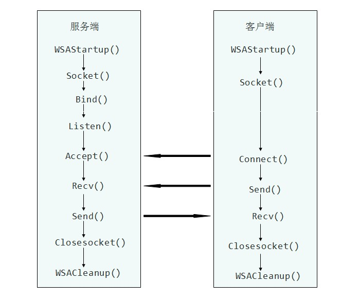

本程序基于C/S架构，实现客户端和服务器之间简单的TCP/IP通信。完成客户端和服务器之间的相互问候。

服务器运行过程如下：
1.服务器启动后，等待客户端的连接请求。
2.当收到客户端的请求后，在界面上显示该客户端的IP地址和端口，以及“Hello,Server!”问候语。
3.服务器向该客户端应答“Hello,Clinet!”问候语。
4.服务器退出。
客户端运行过程如下：
1.客户端启动后，向服务器发起连接请求。
2.当连接请求被接受后，客户端向服务器发送“Hello,Server!”问候语。
3.等待服务器的应答。
4.当客户端收到服务器的“Hello,Clinet!”应答后，客户端退出。


接下来开始设计服务器：
1.启动后显示“服务器初始化成功”“等待客户端的连接...”（此时服务器完成了套接字的初始化工作，并且绑定到端口2012，开始监听来自该端口的请求信息）
2.接受客户端请求（打印输出客户端的端口号以及客户端的IP地址）
3.接收数据（打印输出Hello,Server!）
4.退出（服务器回复客户端Hello Clinet,退出程序）
5.错误处理 
服务器的实现：



服务器工作流程图

Server Code:


```c++
// Server.cpp : 定义控制台应用程序的入口点。
//

#include "stdafx.h"
#include <iostream>
#include <winsock2.h>
#pragma comment(lib, "wsock32.lib")
using namespace std;

#define SERVER_EXIT_OK				0	//服务器正常退出
#define SERVER_DLL_REEOR			1	//调用Windows sockets DLL失败
#define SERVER_API_ERROR			2	//调用Windows sockets API失败
#define	SERVERPORT					2012//服务器TCP端口
#define MAX_NUM_BUF					64	//缓冲区最大尺寸

//变量
char	bufRecv[MAX_NUM_BUF];			//读缓冲区
char	bufSend[MAX_NUM_BUF];			//写缓冲区
SOCKET	sServer;						//服务器监听套接字
SOCKET	sClient;						//接受客户端套接字
BOOL	bConning;						//与客户端的连接状态

//函数
void	InitMember(void);				//初始化成员变量 
int		ExitClient(int nExit);			//客户端退出
BOOL	RecvLine(SOCKET s, char* buf);	//读取一行数据
BOOL	SendLine(SOCKET s, char* buf);	//发送一行数据
int		HandleSocketError(char *str);	//对Windows sockets API调用错误处理
void	ShowSocketMsg(char* str);		//显示错误信息

//主函数
int main(int argc, char* argv[])
{

	InitMember();					//初始化变量
	
	WORD	wVersionRequested;		//应用程序需要Windows sockets DLL的版本
	WSADATA	wsaData;				//Windows sockets DLL版本信息
	int		retVal;					//调用Windows sockets API返回值		
	//初始化Windows Sockets DLL
	wVersionRequested = MAKEWORD(1,1);
	retVal = WSAStartup(wVersionRequested, &wsaData);
	if ( 0 != retVal ) 
	{
		ShowSocketMsg("初始化动态链接库失败!");
		return SERVER_DLL_REEOR;
	}	
	//确保WinSock DLL支持1.1
	if ( LOBYTE( wsaData.wVersion ) != 1 ||	HIBYTE( wsaData.wVersion ) != 1)
	{
		ShowSocketMsg("没有发现一个能使用的动态链接库!");
		WSACleanup( );
		return SERVER_DLL_REEOR; 
	}
	
	
	//创建套接字
	sServer= socket(AF_INET, SOCK_STREAM, IPPROTO_TCP);	
	if(INVALID_SOCKET == sServer)
	{
		return HandleSocketError("Failed socket()!");
	}
	
	//服务器套接字地址 
	SOCKADDR_IN addrServ;
	addrServ.sin_family = AF_INET;
	addrServ.sin_port = htons(SERVERPORT);
	addrServ.sin_addr.s_addr = INADDR_ANY;		
	//绑定套接字
	retVal = bind(sServer, (LPSOCKADDR)&addrServ, sizeof(SOCKADDR_IN));
	if(SOCKET_ERROR == retVal)
	{
		closesocket(sServer);						//关闭套接字
		return HandleSocketError("绑定套接字失败!");	//错误处理
	}
	
	//开始监听 
	retVal = listen(sServer, 1);
	if(SOCKET_ERROR == retVal)
	{
		closesocket(sServer);						//关闭套接字
		return HandleSocketError("监听失败!");//错误处理
	}
	

	//等待客户端的连接	
	cout << "服务器初始化成功!" << endl;
	cout << "等待客户端的连接..." << endl;


	//接受客户端请求
	sockaddr_in addrClient;
	int addrClientlen = sizeof(addrClient);
	sClient = accept(sServer,(sockaddr FAR*)&addrClient, &addrClientlen);
	if(INVALID_SOCKET == sClient)
	{
		closesocket(sServer);							//关闭套接字
		return HandleSocketError("接收客户端请求失败!");	//错误处理
	}else{
		bConning = TRUE;								//客户端请求成功
	}
	
	//显示客户端的IP和端口
	char *pClientIP = inet_ntoa(addrClient.sin_addr);
	u_short  clientPort = ntohs(addrClient.sin_port);	
	cout<<"接收到一个来自客户端的请求."<<endl;
	cout<<"客户端IP: "<<pClientIP<<endl;
	cout<<"端口: "<<clientPort<<endl;


	//接收客户端数据
	if (!RecvLine(sClient, bufRecv))
	{
		return	ExitClient(SERVER_API_ERROR);//退出
	}	
	//显示客户端数据
	cout << bufRecv<<endl;


	//向客户端发送数据
	strcpy_s(bufSend, "Hello,Client!\n");
	if (!SendLine(sClient, bufSend))
	{
		return	ExitClient(SERVER_API_ERROR);
	}
	

	//显示退出信息
	cout << "服务器正在退出..." << endl;
	
	//退出
	return ExitClient(SERVER_EXIT_OK);
}


/*
 *	初始化成员变量
 */
void	InitMember(void)
{
	//初始化读和写缓冲区
	memset(bufRecv, 0, MAX_NUM_BUF);
	memset(bufSend, 0, MAX_NUM_BUF);

	//初始化
	sServer = INVALID_SOCKET;
	sClient = INVALID_SOCKET;

	//没有连接状态
	bConning = FALSE;
}


/*
 *	退出
 */
int		ExitClient(int nExit)
{
	closesocket(sServer);	//关闭监听套接字
	closesocket(sClient);	//关闭连接客户端套接接
	WSACleanup();			//卸载Windows sockets DLL 清理内存
	return nExit;			//退出
}
/*
 *	读一行数据
 */
BOOL	RecvLine(SOCKET s, char* buf)
{
	BOOL	retVal = TRUE;			//返回值
	BOOL	bLineEnd = FALSE;		//行结束
	int		nReadLen = 0;			//读入字节数
	int		nDataLen = 0;			//数据长度
	while (!bLineEnd && bConning)	//与客户端连接 没有换行
	{
		nReadLen = recv(s, buf + nDataLen, 1, 0);//每次接收一个字节
		
		//错误处理
		if (SOCKET_ERROR == nReadLen)
		{
			int nErrCode = WSAGetLastError();//错误代码
			if (WSAENOTCONN == nErrCode)
			{
				ShowSocketMsg("套接字未连接!");
				
			}else if(WSAESHUTDOWN == nErrCode)
			{
				ShowSocketMsg("套接字已关闭!");
				
			}else if (WSAETIMEDOUT == nErrCode)
			{
				ShowSocketMsg("连接已断开!");							
			}else if (WSAECONNRESET == nErrCode)
			{
				ShowSocketMsg("一个现存的远程主机上运行的客户端被强制关闭!");
			}else{}	
			
			retVal = FALSE;	//读数据失败
			break;			//跳出循环						
		}
		
		
		if (0 == nReadLen)//客户端关闭
		{
			retVal = FALSE;	//读数据失败
			break ;			//跳出循环			
		}
		
		//读入数据
		if ('\n' == *(buf + nDataLen))	//换行符
		{
			bLineEnd = TRUE;			//接收数据结束
		}else{
			nDataLen += nReadLen;		//增加数据长度
		}	
	}
	
	return retVal;
}

/*
 *	//发送一行数据
 */
BOOL	SendLine(SOCKET s, char* str)
{
	int retVal;//返回值
	retVal = send(s, str, strlen(str), 0);//一次发送

	//错误处理
	if (SOCKET_ERROR == retVal)
	{
		int nErrCode = WSAGetLastError();//错误代码
		if (WSAENOTCONN == nErrCode)
		{
			ShowSocketMsg("套接字未连接");
			
		}else if(WSAESHUTDOWN == nErrCode)
		{
			ShowSocketMsg("套接字已关闭!");
			
		}else if (WSAETIMEDOUT == nErrCode)
		{
			ShowSocketMsg("连接已断开!");
		}else{}	
		
		return FALSE;	//发送失败
	}
	
	return TRUE;		//发送成功
}
	
/*
 *	错误处理
 */
int		HandleSocketError(char *str)
{
	ShowSocketMsg(str);		//显示错误消息	
	WSACleanup();			//卸载Windows socket DLL	
	return SERVER_API_ERROR;//退出应用程序
}

/*
 *	显示错误
 */
void	ShowSocketMsg(char* str)
{
	MessageBox(NULL, str, "SERVER ERROR", MB_OK);
}
```

Clinet Code:

```c++
// Client.cpp : 定义控制台应用程序的入口点。
//

#include "stdafx.h"

#include <windows.h>
#include <winsock.h>
#include <iostream>
#pragma comment(lib, "wsock32.lib")
using namespace std;


#define CLIENT_EXIT_OK				0	//客户端正常退出
#define CLIENT_DLL_REEOR			1	//调用Windows socket dll失败
#define CLIENT_API_ERROR			2	//调用Windows socket api失败
#define MAX_NUM_BUF					64	//缓冲区的最大长度
#define	SERVERPORT					2012//服务器TCP端口


//变量
char	bufRecv[MAX_NUM_BUF];			//读缓冲区
char	bufSend[MAX_NUM_BUF];			//写缓冲区
SOCKET	sHost;							//socket
BOOL	bConning;						//连接服务器状态

//函数
void	InitMember(void);				//初始化变量
int		ExitClient(int nExit);		//退出
BOOL	RecvLine(SOCKET s, char* buf);	//读取一行数据
void	ShowErrorMsg(void);			//显示错误信息

//主函数
int main()
{

	//初始化变量
	InitMember();

	WORD	wVersionRequested;		//应用程序需要Windows sockets DLL的版本
	WSADATA	wsaData;		//Windows sockets DLL版本信息
	int		retVal;		//调用Windows sockets API返回值

	//初始化Windows Sockets DLL
	wVersionRequested = MAKEWORD(1,1);	
	retVal = WSAStartup(wVersionRequested,(LPWSADATA)&wsaData);
	if ( 0 != retVal ) 
	{
		MessageBox(NULL, "初始化动态链接库失败!", "ERROR", MB_OK);
		return CLIENT_DLL_REEOR;
	}


	//创建Windows socket
	sHost = socket(AF_INET, SOCK_STREAM, IPPROTO_TCP);
	if(INVALID_SOCKET == sHost)
	{
		ShowErrorMsg();			//显示错误信息
		WSACleanup();			//释放资源
		return CLIENT_API_ERROR;//退出
	}

	//准备连接服务器
	cout << "客户端初始化成功!" << endl;
	cout<<"准备连接到服务器..."<<endl;

	
	
	//获取主机的信息
	LPHOSTENT hostEntry;
	char hostname[MAX_NUM_BUF];
	gethostname(hostname,MAX_NUM_BUF);			//获取主机名称
	hostEntry = gethostbyname(hostname);		//获取主机信息
	if(!hostEntry)
	{
		ShowErrorMsg();						//显示错误信息
		return ExitClient(CLIENT_API_ERROR);	//退出
	}
	//设置sockaddr_in
	SOCKADDR_IN addrServ;
	addrServ.sin_family = AF_INET;
	addrServ.sin_addr = *((LPIN_ADDR)*hostEntry->h_addr_list);
	addrServ.sin_port = htons(SERVERPORT);
	//连接服务器
	retVal=connect(sHost,(LPSOCKADDR)&addrServ, sizeof(SOCKADDR_IN));
	if(SOCKET_ERROR == retVal)
	{
		ShowErrorMsg();						//显示错误信息
		return ExitClient(CLIENT_API_ERROR);	//退出
	}else{
		bConning = TRUE;					//连接服务器成功
	}     
	//连接服务器成功
	cout<<"连接服务器成功!"<<endl;


	//向服务器发送数据
	strcpy_s(bufSend, "Hello,Server!\n");
	retVal = send(sHost, bufSend, strlen(bufSend), 0);
	if (SOCKET_ERROR == retVal)
	{
		ShowErrorMsg();						//显示错误信息
		return ExitClient(CLIENT_API_ERROR);	//退出
	}

	//从服务器接收数据
	if (!RecvLine(sHost, bufRecv))
	{
		ShowErrorMsg();						//显示错误信息
		return ExitClient(CLIENT_API_ERROR);	//退出
	}
	//显示服务器的应答
	cout<<bufRecv<<endl;

	//退出
	return ExitClient(CLIENT_EXIT_OK);
}


/*
 *	显示错误信息
 */
void	ShowErrorMsg(void)
{
	int nErrCode = WSAGetLastError();//获取错误代码

	HLOCAL hlocal = NULL;  
	
	//获取错误的文本字符串
	BOOL fOk = FormatMessage(
		FORMAT_MESSAGE_FROM_SYSTEM | FORMAT_MESSAGE_ALLOCATE_BUFFER,
		NULL, nErrCode, MAKELANGID(LANG_ENGLISH, SUBLANG_ENGLISH_US),
		(PTSTR)&hlocal, 0, NULL);
	
	//显示错误信息
	if (hlocal != NULL)
	{
		MessageBox(NULL, (char*)LocalLock(hlocal), "CLIENT ERROR", MB_OK);	
		LocalFree(hlocal);
	}
}


/*
 *	初始化成员变量
 */
void	InitMember(void)
{
	//初始化读和写缓冲区
	memset(bufRecv, 0, MAX_NUM_BUF);
	memset(bufSend, 0, MAX_NUM_BUF);
	//初始化
	sHost = INVALID_SOCKET;
	//没有连接状态
	bConning = FALSE;
}

/*
 *	退出
 */
int		ExitClient(int nExit)
{
	closesocket(sHost);		//关闭套接字
	WSACleanup();			//卸载Windows sockets DLL 清理内存

		//显示退出信息
	cout << "客户端正在退出..." << endl;
	Sleep(20000);
	return nExit;	//退出
}


/*
 *	读取一行数据
 */
BOOL	RecvLine(SOCKET s, char* buf)
{
	BOOL	retVal = TRUE;			//返回值
	BOOL	bLineEnd = FALSE;		//行结束
	int		nReadLen = 0;			//读入字节数
	int		nDataLen = 0;			//数据长度
	while (!bLineEnd && bConning)	//与客户端连接 没有换行
	{
		nReadLen = recv(s, buf + nDataLen, 1, 0);//每次接收一个字节		
		//错误处理
		if (SOCKET_ERROR == nReadLen)
		{			
			retVal= FALSE;	//读数据失败
			break;			//跳出循环						
		}		
		
		if (0 == nReadLen)//客户端关闭
		{
			retVal = FALSE;	//读数据失败
			break ;			//跳出循环			
		}
		
		//读入数据
		if ('\n' == *(buf + nDataLen))	//换行符
		{
			bLineEnd = TRUE;			//接收数据结束
		}else{
			nDataLen += nReadLen;		//增加数据长度
		}	
	}
	
	return retVal;
}
```

