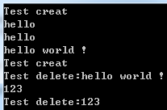
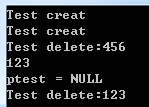
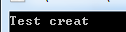
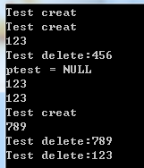
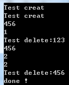

# 智能指针用法

## auto_prt

```c++
class Test
{
public:
    Test(string s)
    {
        str = s;
       cout<<"Test creat\n";
    }
    ~Test()
    {
        cout<<"Test delete:"<<str<<endl;
    }
    string& getStr()
    {
        return str;
    }
    void setStr(string s)
    {
        str = s;
    }
    void print()
    {
        cout<<str<<endl;
    }
private:
    string str;
};
 
 
int main()
{
    auto_ptr<Test> ptest(new Test("123"));
    ptest->setStr("hello ");
    ptest->print();
    ptest.get()->print();
    ptest->getStr() += "world !";
    (*ptest).print();
    ptest.reset(new Test("123"));
    ptest->print();
    return 0;
}
```

运行结果如下

[](https://images0.cnblogs.com/blog/517264/201312/03230704-1f879aa5c00443ac9de20749582c8a14.png)

如上面的代码：智能指针可以像类的原始指针一样访问类的public成员，成员函数get()返回一个原始的指针，成员函数reset()重新绑定指向的对象，而原来的对象则会被释放。注意我们访问auto_ptr的成员函数时用的是“.”，访问指向对象的成员时用的是“->”。我们也可用声明一个空智能指针auto_ptr<Test>ptest();

当我们对智能指针进行赋值时，如ptest2 = ptest，ptest2会接管ptest原来的内存管理权，ptest会变为空指针，如果ptest2原来不为空，则它会释放原来的资源，基于这个原因，应该避免把auto_ptr放到容器中，因为算法对容器操作时，很难避免STL内部对容器实现了赋值传递操作，这样会使容器中很多元素被置为NULL。判断一个智能指针是否为空不能使用if(ptest == NULL)，应该使用if(ptest.get() == NULL)，如下代码    

```c++
int main()
{
    auto_ptr<Test> ptest(new Test("123"));
    auto_ptr<Test> ptest2(new Test("456"));
    ptest2 = ptest;
    ptest2->print();
    if(ptest.get() == NULL)cout<<"ptest = NULL\n";
    return 0;
}
```

[](https://images0.cnblogs.com/blog/517264/201312/03230705-3ad8345e61134d06a4a9b37b1c92cc5a.png)

还有一个值得我们注意的成员函数是release，这个函数只是把智能指针赋值为空，但是它原来指向的内存并没有被释放，相当于它只是释放了对资源的所有权，从下面的代码执行结果可以看出，析构函数没有被调用。

```c++
int main()
{
    auto_ptr<Test> ptest(new Test("123"));
    ptest.release();
    return 0;
}
```

[](https://images0.cnblogs.com/blog/517264/201312/03230708-111c78d76d184eff813cde875f7c55c9.png)

那么当我们想要在中途释放资源，而不是等到智能指针被析构时才释放，我们可以使用ptest.reset(); 语句。


## unique_ptr

unique_ptr,**是用于取代c++98的auto_ptr的产物**,在c++98的时候还没有移动语义(move semantics)的支持,因此对于auto_ptr的控制权转移的实现没有核心元素的支持,但是还是实现了auto_ptr的移动语义,这样带来的一些问题是拷贝构造函数和复制操作重载函数不够完美,具体体现就是把auto_ptr作为函数参数,传进去的时候控制权转移,转移到函数参数,当函数返回的时候并没有一个控制权移交的过程,所以过了函数调用则原先的auto_ptr已经失效了.在c++11当中有了移动语义,使用move()把unique_ptr传入函数,这样你就知道原先的unique_ptr已经失效了.移动语义本身就说明了这样的问题,比较坑爹的是标准描述是说对于move之后使用原来的内容是未定义行为,并非抛出异常,所以还是要靠人肉遵守游戏规则.再一个,auto_ptr不支持传入deleter,所以只能支持单对象(delete object),而unique_ptr对数组类型有偏特化重载,并且还做了相应的优化,比如用[]访问相应元素等.

unique_ptr 是一个独享所有权的智能指针，它提供了严格意义上的所有权，包括：

1、拥有它指向的对象

2、无法进行复制构造，无法进行复制赋值操作。即无法使两个unique_ptr指向同一个对象。但是可以进行移动构造和移动赋值操作

3、保存指向某个对象的指针，当它本身被删除释放的时候，会使用给定的删除器释放它指向的对象

unique_ptr 可以实现如下功能：

1、为动态申请的内存提供异常安全

2、讲动态申请的内存所有权传递给某函数

3、从某个函数返回动态申请内存的所有权

4、在容器中保存指针

5、auto_ptr 应该具有的功能

```c++
unique_ptr<Test> fun()
{
    return unique_ptr<Test>(new Test("789"));
}
int main()
{
    unique_ptr<Test> ptest(new Test("123"));
    unique_ptr<Test> ptest2(new Test("456"));
    ptest->print();
    ptest2 = std::move(ptest);//不能直接ptest2 = ptest
    if(ptest == NULL)cout<<"ptest = NULL\n";
    Test* p = ptest2.release();
    p->print();
    ptest.reset(p);
    ptest->print();
    ptest2 = fun(); //这里可以用=，因为使用了移动构造函数
    ptest2->print();
    return 0;
}
```

[](https://images0.cnblogs.com/blog/517264/201312/03230709-e372a0803a3847a7830a4506cf246f30.png)

unique_ptr 和 auto_ptr用法很相似，不过不能使用两个智能指针赋值操作，应该使用std::move; 而且它可以直接用if(ptest == NULL)来判断是否空指针；release、get、reset等用法也和auto_ptr一致，使用函数的返回值赋值时，可以直接使用=, 这里使用c++11 的移动语义特性。另外注意的是当把它当做参数传递给函数时（使用值传递，应用传递时不用这样），传实参时也要使用std::move,比如foo(std::move(ptest))。它还增加了一个成员函数swap用于交换两个智能指针的值


## share_ptr


从名字share就可以看出了资源可以被多个指针共享，它使用计数机制来表明资源被几个指针共享。可以通过成员函数use_count()来查看资源的所有者个数。出了可以通过new来构造，还可以通过传入auto_ptr, unique_ptr,weak_ptr来构造。当我们调用release()时，当前指针会释放资源所有权，计数减一。当计数等于0时，资源会被释放。

```c++
int main()
{
    shared_ptr<Test> ptest(new Test("123"));
    shared_ptr<Test> ptest2(new Test("456"));
    cout<<ptest2->getStr()<<endl;
    cout<<ptest2.use_count()<<endl;
    ptest = ptest2;//"456"引用次数加1，“123”销毁
    ptest->print();
    cout<<ptest2.use_count()<<endl;//2
    cout<<ptest.use_count()<<endl;//2
    ptest.reset();
    ptest2.reset();//此时“456”销毁
    cout<<"done !\n";
    return 0;
}
```

[](https://images0.cnblogs.com/blog/517264/201312/03230709-fd8964794d4140e2a7c870e497789e44.png)


## weak_ptr

